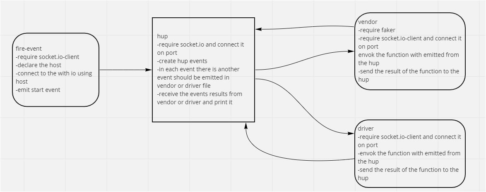

# socket.io
build delivery tracking system, creating an event observable over a network with Socket.io libraries.This allows communication between Server and Client applications.The intent here is to build the data services that would drive a suite of applications where we can see pickups and deliveries in real-time.

[actions link](https://github.com/idreesalmasri/socket.io/actions)  
[PR link](https://github.com/idreesalmasri/socket.io/pull/1)
